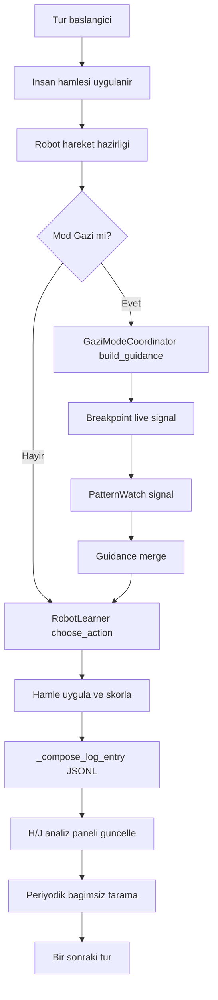

# SAYISAL TETRIS V3 - Metodoloji Dokumani

## 1) Amac ve Kapsam
Bu dokuman, SAYISAL TETRIS V3 sisteminin teknik calisma prensibini, modullerini, siniflarini, kritik metotlarini, veri giris/cikis sozlesmelerini ve ajanlar arasi veri akislarini tanimlar.

Kapsam:
- Ana oyun motoru ve UI orkestrasyonu
- Robot karar motoru (strateji + onerici/proposal)
- Gazi 3 ajan katmani
- Kirilma analizi (breakpoint) katmani
- Oyun-bagimsiz pattern-watch katmani
- Loglama ve analiz panelleri
- SID muzik yonetimi

## 2) Ust Mimari
Sistem tek prosesli bir Tkinter uygulamasi olarak calisir. Her turde su ana adimlar islenir:
1. Girdi toplama (insan hamlesi + robot hamlesi tetigi)
2. Robot aday hamle olusturma ve puanlama
3. (Gazi modunda) 3 ajan direktifi + kirilma + pattern sinyalleri ile agirlik birlesimi
4. Hamle uygulama, patlama/puan hesaplama
5. Tur logu yazimi (JSONL)
6. Arayuz ve analiz paneli guncellemesi
7. Periyodik bagimsiz pattern taramasi

## 3) Modul Envanteri

### 3.1 tetris_v3_windows_ai.py
Rol: Ana uygulama, oyun dongusu, robot karar orkestrasyonu, log sozlesmesi, H/J analiz ekranlari.

Onemli siniflar:
- MiniNN
- StrategyGenerator
- RobotLearner
- GameLogger
- VersusGame

Kritik sorumluluklar:
- Oyun state yonetimi (board, tur, level, skor, sonraki sayi zinciri)
- Robot secim pipeline'i
- Gazi + breakpoint + pattern_watch sinyal birlestirme
- Tur logu ve analiz icin veri uretimi

### 3.2 gazi_mode_agents.py
Rol: Gazi moduna ozel 3 ajanli direktif motoru.

Siniflar:
- _BaseObserver
- EnemyObserverAgent
- RobotObserverAgent
- DecisionFusionAgent
- GaziModeCoordinator

Kritik ciktisi:
- gazi direktifi (target_cols, strategy_weights, proposal_weights, oranlar, command_text)

### 3.3 breakpoint_agent.py
Rol: Oyuncu ile robot arasindaki kirilma anini 10/20/30 pencere analiziyle yakalama.

Sinif:
- BreakpointMomentumAgent

Kritik ciktisi:
- live warning sinyali + agirlik/tavsiyeler

### 3.4 pattern_watch_agent.py
Rol: Canli oyundan bagimsiz sekilde son loglari periyodik tarayarak oyuncu patern sapmalarini bulma.

Sinif:
- PatternWatchAgent

Kritik ciktisi:
- rolling summary + warning + agirlik/tavsiye

### 3.5 sid_player.py
Rol: SID muzik oynatici surec yonetimi.

Sinif:
- SidMusicManager

Kritik sorumluluk:
- harici sidplayfp sureci baslat/guncelle/durdur

## 4) Sinif ve Metot Duzeyi Teknik Ozeti

### 4.1 RobotLearner (tetris_v3_windows_ai.py)
Kritik metotlar:
- choose_action(board, current_num, next_num, level, game_mode, robot_profile, gazi_guidance)
  - Giris:
    - board: 2D tablo
    - current_num: aktif tas degeri
    - next_num: bir sonraki tas
    - level: oyun seviyesi
    - game_mode: easy/normal/hard/gazi
    - robot_profile: strateji profili
    - gazi_guidance: opsiyonel direktif sozlugu
  - Cikis:
    - (col, meta)
    - col: secilen kolon
    - meta: secim aciklama payload'i
      - candidate_snapshot
      - proposal
      - proposal_decision
      - robot_features
      - gazi komut/oranlari (gazi modunda)

- save_memory()
  - Robot ogrenme durumunu kalici depoya yazar.

Karar hatti notu:
- Aday kolonlar puanlanir.
- Profil ve mod etkisi ile skorlar ayarlanir.
- Proposal motorlari devreye girer.
- Gazi direktifi varsa strategy/proposal agirliklari skor zincirine eklenir.
- Son karar ve meta payload uretilir.

### 4.2 VersusGame (tetris_v3_windows_ai.py)
Kritik metotlar:
- prepare_robot_move()
  - Gazi modunda once gazi_agents.build_guidance cagrilir.
  - Sonra _merge_breakpoint_guidance ve _merge_pattern_watch_guidance ile birlesik direktif olusturulur.
  - RobotLearner.choose_action bu birlesik direktif ile cagrilir.

- _compose_log_entry(player_type, board, num, next_num, strategy, move, result, logic, extra)
  - Tur log kaydinin resmi sozlesmesini olusturur.

- _merge_breakpoint_guidance(guidance)
  - breakpoint signal icindeki target_cols / strategy_weights / proposal_weights / command_hint alanlarini ana guidance'a toplar.

- _merge_pattern_watch_guidance(guidance)
  - pattern_watch signal icindeki ayni alanlari ana guidance'a toplar.

- tick()
  - Oyun dongusu.
  - PatternWatchAgent takip tetigi (periyodik) burada calisir.

- manual_pattern_watch_run()
  - Manuel tetik ile bagimsiz pattern analizi baslatir.

### 4.3 GaziModeCoordinator ve DecisionFusionAgent (gazi_mode_agents.py)
Kritik metotlar:
- GaziModeCoordinator.build_guidance(player_board, robot_board, turn, level)
  - EnemyObserverAgent + RobotObserverAgent snapshotlarini toplar.
  - DecisionFusionAgent.build_directive ile direktif payload uretir.

- DecisionFusionAgent.build_directive(enemy_snap, robot_snap, player_board, robot_board, turn, level)
  - Cikis payload alanlari:
    - turn
    - style
    - target_cols
    - strategy_weights
    - proposal_weights
    - freedom_ratio
    - reject_chance
    - reject_cap_ratio
    - logical_ratio
    - command_text
    - skill_enemy, skill_robot
    - enemy_last_30, robot_last_30
    - player_dense_cols, robot_dense_cols, robot_holes
    - created_at

Not:
- reject_cap_ratio degeri, random-reject davranisini ust sinirla sinirlar (or. 0.30).

### 4.4 BreakpointMomentumAgent (breakpoint_agent.py)
Kritik metotlar:
- run_historical_analysis(deep=True)
  - Son loglardan 10/20/30 pencere baseline profilleri cikarir.
  - historical_profiles ve rulebook olusturur.

- observe_turn(player_log, robot_log)
  - Canli tur kayitlarini recent_human/recent_robot kuyruklarina ekler.

- build_live_warning(turn)
  - Her pencere icin live vs baseline farki hesaplar.
  - warning listesi ve agirlik onerileri uretir.
  - Cikis payload:
    - turn
    - signals
    - warnings
    - target_cols
    - strategy_weights
    - proposal_weights
    - command_hint
    - dominant_historical_objective

Kirilma sinyal kriter ornekleri:
- explosion_value_delta artisi
- special_usage_delta artisi
- cluster_ratio_delta artisi
- special_logic_delta artisi
- sum9_intent_delta artisi
- future_plan_delta artisi

### 4.5 PatternWatchAgent (pattern_watch_agent.py)
Kritik metotlar:
- analyze_all_logs(deep=False)
  - Son loglari tarar, human/robot ortalamalarini ve niyet metriklerini hesaplar.
  - Cikis payload:
    - warnings
    - target_cols
    - strategy_weights
    - proposal_weights
    - command_hint
    - summary (rolling_summary)

- follow_independent(force=False)
  - scan_interval uzerinden periyodik, oyun-bagimsiz tarama tetigi.

Metrik ornekleri:
- human_avg_points, human_avg_explosions
- human_special_efficiency
- human_sum9_focus_rate
- human_future_plan_rate
- human_cluster_ratio
- human_top_cols

### 4.6 SidMusicManager (sid_player.py)
Kritik metotlar:
- start()
- play_index(idx)
- update()
- stop()

Amac:
- Playlist ve surec durumunu yoneterek arka planda SID muzik akisini kararlı tutmak.

### 4.7 Ayrintili I/O Tip Tablosu

| Sinif | Metot | Girdi Tipi | Cikti Tipi | Yan Etki |
|---|---|---|---|---|
| RobotLearner | choose_action(board, current_num, next_num, level, game_mode, robot_profile, gazi_guidance) | board: list[list[int\|str\|None]], current_num: int, next_num: int, level: int, game_mode: str, robot_profile: str, gazi_guidance: dict\|None | tuple[int, dict] | Robot secim metasi uretir, proposal/guidance alanlarini doldurur |
| RobotLearner | analyze_previous_logs(max_files, max_lines) | max_files: int, max_lines: int | tuple[int, float, int, int] | Gecmis log replay egitimi yapar |
| RobotLearner | save_memory() | - | None | Model/agac durumunu diskte memory altina yazar |
| VersusGame | prepare_robot_move() | - (self state) | None | Gazi + Breakpoint + PatternWatch guidance birlestirir, robot hamlesini hazirlar |
| VersusGame | _compose_log_entry(player_type, board, num, next_num, strategy, move, result, logic, extra) | player_type: str, board: list[list], num: int, next_num: int, strategy: str, move: int\|dict, result: dict, logic: str, extra: dict | dict | Tur log payload'i olusturur |
| VersusGame | _merge_breakpoint_guidance(guidance) | guidance: dict\|None | dict | Guidance icine breakpoint agirliklarini toplar |
| VersusGame | _merge_pattern_watch_guidance(guidance) | guidance: dict\|None | dict | Guidance icine pattern-watch agirliklarini toplar |
| VersusGame | manual_pattern_watch_run() | - | None | Derin pattern tarama calistirir, durum mesaji uretir |
| VersusGame | _analysis_text_payload() | - (self state) | str | H penceresi icin okunabilir metin raporu uretir |
| VersusGame | _refresh_analysis_window() | - | None | H penceresini gunceller |
| VersusGame | show_analysis_window(_event) | event\|None | None | H tusu ile klasik okunabilir analiz penceresi acar |
| VersusGame | _refresh_dashboard_window() | - | None | J dashboard kartlarini ve tablolari gunceller |
| VersusGame | show_dashboard_window(_event) | event\|None | None | J tusu ile kartli dashboard penceresi acar |
| VersusGame | tick() | - | None | Oyun dongusunu, periyodik pattern takibini ve pencere refreshini surdurur |
| GaziModeCoordinator | build_guidance(player_board, robot_board, turn, level) | player_board: list[list], robot_board: list[list], turn: int, level: int | dict | 3 ajan snapshot/fusion ile direktif uretir |
| GaziModeCoordinator | run_historical_analysis(deep) | deep: bool | dict | Gazi ajan tarihsel profil ozetini olusturur |
| GaziModeCoordinator | follow_log_updates() | - | dict\|None | Loglardan yeni veri cekerek ajan state gunceller |
| DecisionFusionAgent | build_directive(enemy_snap, robot_snap, player_board, robot_board, turn, level) | enemy_snap: dict, robot_snap: dict, player_board: list[list], robot_board: list[list], turn: int, level: int | dict | target/agirlik/oran/komut iceren ana Gazi direktifini uretir |
| BreakpointMomentumAgent | run_historical_analysis(deep) | deep: bool | dict | 10/20/30 pencere baseline profilleri cikarir |
| BreakpointMomentumAgent | observe_turn(player_log, robot_log) | player_log: dict\|None, robot_log: dict\|None | None | Canli tur pencerelerini gunceller |
| BreakpointMomentumAgent | build_live_warning(turn) | turn: int | dict | Kirilma warning + agirlik payload'i uretir |
| PatternWatchAgent | analyze_all_logs(deep) | deep: bool | dict | Oyun-bagimsiz rolling summary ve warning payload'i uretir |
| PatternWatchAgent | follow_independent(force) | force: bool | dict\|None | interval doldugunda bagimsiz tarama yapar |
| SidMusicManager | start() | - | bool | sidplayfp surecini baslatir |
| SidMusicManager | play_index(idx) | idx: int | bool | Playlist icinde parcayi calar |
| SidMusicManager | update() | - | None | Surec saglik/playlist durumunu gunceller |
| SidMusicManager | stop() | - | None | Muzik surecini sonlandirir |

## 5) Veri Sozlesmeleri (Input/Output)

### 5.1 Tur Log Kaydi Sozlesmesi (_compose_log_entry)
Her tur icin JSON kaydi temel olarak su alanlari tasir:
- timestamp: ISO zaman
- turn: int
- player: Human/Robot
- num, next_num, next_next_num: int
- future_numbers: [next_num, next_next_num]
- board: 2D board snapshot
- open_strategies: int
- selected_strategy: str
- move_decision: secilen kolon/hamle bilgisi
- points, exploded_cells, explosions: sayisal sonuc
- strategy_update: str
- logic: aciklama metni
- potential_explosions, risk, priority
- proposal, proposal_decision
- robot_features
- candidate_snapshot: hamle oncesi aday kolon/puan goruntusu
- gazi_command: birlesik komut metni

### 5.2 Guidance Birlesim Sozlesmesi
Birlesik guidance objesi, 3 kaynaktan beslenir:
1. GaziModeCoordinator.build_guidance
2. BreakpointMomentumAgent.build_live_warning
3. PatternWatchAgent.analyze_all_logs / follow_independent

Ortak alanlar:
- target_cols: list[int]
- strategy_weights: dict[str,float]
- proposal_weights: dict[str,float]
- command_text veya command_hint: str

Birlesim kurali:
- target_cols: tekillesmis birlesim
- strategy_weights/proposal_weights: anahtar bazli toplama
- komut: metin birlestirme (pipe ile)

### 5.3 Candidate Snapshot Sozlesmesi
candidate_snapshot listesi, her aday hamle icin en az su tipte bilgi tasir:
- col
- base score/final score
- profile/mod/guidance etkileri
- varsa proposal etkisi

Amac:
- Karar oncesi gorunurluk
- Sonradan aciklanabilirlik (H/J paneli ve offline analiz)

## 6) Ajanlar ve Gorev Dagilimi

### 6.1 Gazi 3 Ajan
- EnemyObserverAgent:
  - Oyuncu tarafi davranis sinyallerini cikarir.
- RobotObserverAgent:
  - Robot tarafi performans ve zayiflik sinyallerini cikarir.
- DecisionFusionAgent:
  - Iki gozlemciyi birlestirip uygulanabilir direktif payload'a cevirir.

### 6.2 BreakpointMomentumAgent
- Oyuncudaki davranis degisimini pencere fark analizleriyle yakalar.
- Baseline'dan ani sapmalari warning ve agirliklara donusturur.

### 6.3 PatternWatchAgent
- Canli tura bagli olmadan son loglardan bagimsiz trend toplar.
- Uzun vadeli patern kaymalarini yakalar.

## 7) Modlara Gore Aktif Yapi Matrisi

| Mod | Temel Robot Secim | Gazi 3 Ajan | Breakpoint | PatternWatch | Guidance Merge |
|---|---|---|---|---|---|
| easy | aktif (yumusak/risk dusuk) | pasif | pasif/izleme | pasif/izleme | yok |
| normal | aktif (denge) | pasif | pasif/izleme | pasif/izleme | yok |
| hard | aktif (agresif skor) | pasif | pasif/izleme | pasif/izleme | yok |
| gazi | aktif (tam acik) | aktif | aktif | aktif | aktif |

Not:
- Breakpoint ve PatternWatch log tarafinda calisabilir; ancak karar agirligina sistematik birlesim gazi modunda zorunlu hale gelir.

## 8) Uctan Uca Veri Akisi

## 9) Gazi Komutunun Karar Skoruna Etkisi
Gazi guidance, karar skoruna iki ana kanal ile etki eder:
1. strategy_weights
   - Adayin secili stratejisi ile eslesen agirliklar final skora bias olarak eklenir.
2. proposal_weights
   - Onerici motor skorlarina ek agirlik verilir.

Ek parametreler:
- freedom_ratio: robotun serbest secim payi
- reject_chance: oneriyi reddetme olasiligi
- reject_cap_ratio: random-reject ust siniri
- logical_ratio: mantikli secim kanalina ayrilan oran

Bu sayede sistem, hem acik kuralli direktif hem de kontrollu ozerklik birlikte calistirir.

### 9.1 Formel Skor Denklemi (Gazi Agirlik Birlesimi)

Her aday kolon icin temel karar skoru:

$$
S_{base}(c) = S_{heur}(c) + S_{profile}(c, p) + S_{mode}(c, m)
$$

Burada $c$ aday kolon, $p$ robot profili, $m$ oyun modudur.

Gazi strateji agirligi katkisi:

$$
S_{str}(c) = \lambda_s \cdot w_{str}(\sigma(c))
$$

- $\sigma(c)$: adayin bagli oldugu strateji etiketi
- $w_{str}$: guidance.strategy_weights icindeki agirlik
- $\lambda_s$: strateji etkisi carpani (uygulamada sabit bir olcek)

Proposal motoru etkisi:

$$
S_{prop}(c) = \lambda_p \cdot \big(S_{prop0}(c) + w_{prop}(e(c))\big)
$$

- $S_{prop0}(c)$: proposal motorunun ham adaya verdigi skor
- $e(c)$: adayi oneren engine etiketi
- $w_{prop}$: guidance.proposal_weights icindeki engine agirligi

Toplam birlesik skor:

$$
S_{final}(c) = S_{base}(c) + S_{str}(c) + S_{prop}(c) + S_{target}(c)
$$

Hedef kolon bonusu:

$$
S_{target}(c)=
\begin{cases}
\lambda_t, & c \in T \\
0, & c \notin T
\end{cases}
$$

- $T$: guidance.target_cols
- $\lambda_t$: hedef kolon bonusu

Karar secimi:

$$
c^* = \arg\max_c S_{final}(c)
$$

Ancak Gazi ozerklik mekanizmasi ile son secim su sekilde duzeltilebilir:

$$
P(\text{reject}) = \min\big(reject\_chance,\; reject\_cap\_ratio\big)
$$

$$
P(\text{logic-branch}) = logical\_ratio, \qquad P(\text{free-branch}) = freedom\_ratio
$$

Boylece secim, tek bir deterministik skor yerine agirlikli ama kontrollu stokastik bir karar politikasi ile tamamlanir.

## 10) H/J Analiz Ekrani Metodolojisi
- H ve J farkli analiz pencereleri acar.
- Panelde:
  - H: metin tabanli, yuksek okunabilirlikli klasik analiz raporu
  - J: kartli dashboard, tablo hizalamasi ve metrik yorumlari
  - J panelinde 4 ondalikli gorunum
- Kaynak veriler:
  - son directive
  - candidate_snapshot
  - logdan cikarilan son trendler

## 11) Log ve Kalicilik Stratejisi
- Ana tur loglari: oyun log dizininde JSONL
- Gazi ajan loglari: logs/gazi altinda toplanir
- Legacy path'ten bootstrap/merge destegi vardir
- dist dagitiminda dokumanlarin ayni versiyonu tutulur

## 12) Dogruluk ve Aciklanabilirlik Ilkeleri
- Karar once aday goruntusu (candidate_snapshot) zorunlu kayit
- Gelecek tas zinciri (future_numbers) zorunlu kayit
- Canli + tarihsel pencere karsilastirmasi
- Tek ajan yerine cok ajanli sinyal birlesimi
- H/J panelinden insan-okunur gerekceleme

## 13) Riskler ve Iyilestirme Alanlari
- Ajan agirlik carpani kalibrasyonu modele gore asiri duyarlı olabilir.
- Log schema versiyonlanmasi resmi hale getirilirse geriye uyumluluk guclenir.
- Guidance birlesiminde catismali komutlar icin onceliklendirme politikasi acik bir standarda baglanabilir.

## 14) Sonuc
Bu mimari, robot kararini 3 katmanda aciklanabilir hale getirir:
1. Anlik secim motoru (RobotLearner)
2. Taktik direktif katmani (Gazi 3 ajan)
3. Davranis sapma katmanlari (Breakpoint + PatternWatch)

Boylece sistem hem skor optimizasyonu hem de oyuncu davranisina adaptif tepkiyi birlikte saglar.
